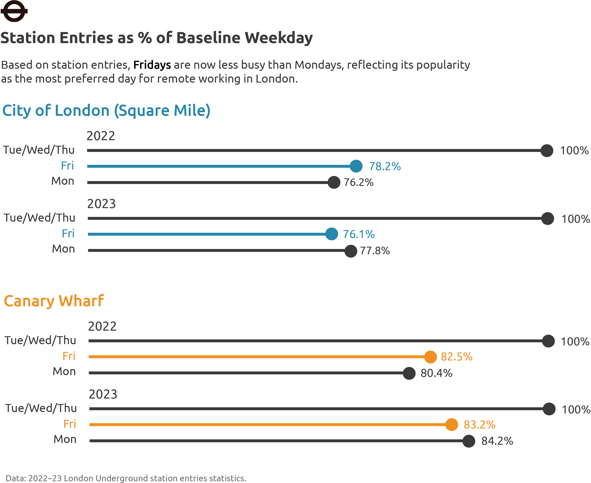

```{r setup, include=FALSE}
knitr::opts_chunk$set(
  echo = TRUE,
  # results = 'hide',
  message = FALSE,
  warning = FALSE,
  fig.align = 'left')

# For reproducibility of code
library(groundhog)
groundhog.day = "2024-10-11"

# Other libraries to load
groundhog.library("tidyverse", groundhog.day)
groundhog.library("ggrepel", groundhog.day)
groundhog.library("scales", groundhog.day)
groundhog.library("gridExtra", groundhog.day)
groundhog.library("kableExtra", groundhog.day)
groundhog.library("pandoc", groundhog.day)
groundhog.library("plotly", groundhog.day)


```

<br>


```{r essential_code, results='hide'}

# Import the .csv files converted from the .xlsx files from TfL
data2022 <- read.csv(file.path("PART 2—REPRODUCIBLE DATA STORY/data", "tfl2022data.csv"))
data2023 <- read.csv(file.path("PART 2—REPRODUCIBLE DATA STORY/data", "tfl2023data.csv"))

# Remove duplicate stations or non-operational stations with custom function
remove_zero_annualised <- function(data) {
  data_clean <- data[data$ANNUALISED_INANDOUT != 0, ]
  return(data_clean)
}

data2022_clean <- remove_zero_annualised(data2022)
data2023_clean <- remove_zero_annualised(data2023)

data2022 <- NULL
data2023 <- NULL

data2023_clean <- data2023_clean %>%
  mutate(across(-c(STATION, LINE), as.numeric))

data2023_clean <- na.omit(data2023_clean)

# Selecting stations within the City of London / Square Mile
sqm_stations <- c("Aldgate", "Bank", "Monument", "Barbican", "Blackfriars",
              "Cannon Street", "Chancery Lane", "Liverpool Street", 
              "Mansion House", "Moorgate", "St. Paul's", 
              "Aldgate East", "Farringdon", "Temple", "Tower Hill")

data_2022_sqm <- data2022_clean %>%
  filter(str_detect(STATION, paste(sqm_stations, collapse = "|")))

data_2023_sqm <- data2023_clean %>%
  filter(str_detect(STATION, paste(sqm_stations, collapse = "|")))

# Selecting stations within Canary Wharf
wharf_stations <- c("Canary Wharf", "Heron Quays", "West India Quay")

data_2022_wharf <- data2022_clean %>%
  filter(str_detect(STATION, paste(wharf_stations, collapse = "|")))

data_2023_wharf <- data2023_clean %>%
  filter(str_detect(STATION, paste(wharf_stations, collapse = "|")))

# Aggregating stations within the City of London / Square Mile 
summary_2022_sqm <- data_2022_sqm %>%
  select(-LINE, -STATION) %>%
  summarise(across(everything(), sum, na.rm = TRUE)) %>%
  mutate(Year = 2022)

summary_2023_sqm <- data_2023_sqm %>%
  select(-LINE, -STATION) %>%
  summarise(across(everything(), sum, na.rm = TRUE)) %>%
  mutate(Year = 2023)

summary_sqm <- bind_rows(summary_2022_sqm, summary_2023_sqm)
summary_sqm <- summary_sqm[, c("Year", setdiff(names(summary_sqm), "Year"))]
rm(list = c("summary_2022_sqm", "summary_2023_sqm"))

# Aggregating stations within Canary Wharf 
summary_2022_wharf <- data_2022_wharf %>%
  select(-LINE, -STATION) %>%
  summarise(across(everything(), sum, na.rm = TRUE)) %>%
  mutate(Year = 2022)

summary_2023_wharf <- data_2023_wharf %>%
  select(-LINE, -STATION) %>%
  summarise(across(everything(), sum, na.rm = TRUE)) %>%
  mutate(Year = 2023)

summary_wharf <- bind_rows(summary_2022_wharf, summary_2023_wharf)
summary_wharf <- summary_wharf[, c("Year", setdiff(names(summary_wharf), "Year"))]
rm(list = c("summary_2022_wharf", "summary_2023_wharf"))

# Set up tables for display
summary_sqm_table <- kable(summary_sqm, format = "html", caption = "Summary SQM Data") %>%
  kable_styling(bootstrap_options = c("striped", "hover"))

summary_wharf_table <- kable(summary_wharf, format = "html", caption = "Summary Wharf Data") %>%
  kable_styling(bootstrap_options = c("striped", "hover"))
```

### Back to the cubicles!

Jumping on work calls in the comfort of your home. Taking your kids to school and back. Making your own healthy, balanced meals. Skipping the crowded morning and evening commutes.

For hundreds of thousands of workers in Central London, this has been the experience of the pandemic with the implementation of flexible working — **but for some, this may soon come to an end.** From [Amazon](https://www.ft.com/content/401e13fe-d065-4c07-9b51-e21fa38ad6e1) to [Zoom](https://www.bbc.com/news/business-66432173) (the irony!), return-to-office mandates are arriving fast, where working-from-home days are cut short or eliminated altogether.

What does this mean for the **730,000 Londoners** working in the traditional financial district of the [Square Mile](https://www.cityoflondon.gov.uk/supporting-businesses/economic-research/research-publications/city-statistics-briefing) and the second Central Business District of [Canary Wharf](https://www.knightfrank.co.uk/office-space/insights/help-with-moving/seven-things-you-didnt-know-canary-wharf/)? The most recent travel data from the Transport for London ([TfL](https://crowding.data.tfl.gov.uk/)) shows that following the lifting of lockdown, ridership in Canary Wharf has increased the most (compared to the Square Mile and London overall), as represented in this interactive bar chart. Given that these are the two biggest (and dominant) employment clusters in the city, this is evidence of a **stronger rebound in commuting compared to travel overall** — with important implications for the permanence of working from home (WFH).

```{r overall_ridership, fig.height=3, fig.width=8}

# Create a summary table comparing the three geographies
ridership_summary <- data.frame(
  year = c("London overall", "The Square Mile", "Canary Wharf"),
  pct_increase = c(
    (mean(data2023_clean$ANNUALISED_INANDOUT, na.rm = TRUE) 
      / mean(data2022_clean$ANNUALISED_INANDOUT, na.rm = TRUE) - 1), 
    (subset(summary_sqm, Year == 2023)$ANNUALISED_INANDOUT
      / subset(summary_sqm, Year == 2022)$ANNUALISED_INANDOUT - 1), 
    (subset(summary_wharf, Year == 2023)$ANNUALISED_INANDOUT
      / subset(summary_wharf, Year == 2022)$ANNUALISED_INANDOUT - 1))
)

# Set order for the year variable
year_order <- c("London overall", "Canary Wharf", "The Square Mile")

# Create ggplot with custom hover text
p <- ggplot(ridership_summary, aes(
  x = factor(year, levels = year_order), 
  y = pct_increase, 
  fill = factor(year, levels = rev(year_order)),
  text = paste0(scales::percent(pct_increase, accuracy = 0.1))
  )) +
  geom_bar(stat = "identity", width = 0.5) +
  coord_flip() +
  labs(x = NULL, 
       y = "Percentage increase in ridership from 2022 to 2023", 
       fill = "Geography") +
  theme_minimal() +
  theme(legend.position = "none") + 
  scale_y_continuous(labels = scales::percent_format(accuracy = 0.1)) +
  scale_fill_manual(values = c("#2E86AB", "#F18F01", "#9F2042"))

# Make the plot interactive with ggplotly, using custom hover text
plotly_chart <- ggplotly(p, tooltip = "text") %>%
  layout(
    title = list(
      text = paste0("Tube ridership has recovered faster in both the ",
                    "<span style='color:#2E86AB'><b>Square Mile</b></span> and ",
                    "<span style='color:#F18F01'><b>Canary Wharf</b></span> <br>compared to ",
                    "<span style='color:#9F2042'><b>London overall</b></span>",
                    "<br><sup>Data: TfL annualised ridership data, 2022 to 2023</sup>"),
      x = 0.1,  # Left-align title
      y = 0.9,  # Adjust y position for title
      font = list(size = 15)
    ),
    margin = list(
      l = 150,  # Increase left margin 
      r = 50,   # Adjust right margin 
      t = 100,   # Adjust top margin 
      b = 50    # Adjust bottom margin 
    ),
    font = list(family = "Ubuntu"),  
    hoverlabel = list(
      font = list(family = "Ubuntu")  
    )
  )

plotly_chart
```

### The TGIF consensus

The overall trend is clear: working in the office is slowly making a comeback in Central London. When we delve into how travel patterns change across the week, we begin to see a richer picture of London in this period of transition. In particular, for both business districts in Central London, **Fridays have emerged as the preferred day for working from home**, with average trips lower than that of Mondays, and of the Tuesday—Thursday baseline.

For the [**Square Mile**]{style="color:#2E86AB;"}, the weekly trend can be explored in the interactive plot below. In 2023, Friday ridership is **23.9%** below the Tuesday—Thursday baseline, and 2.2% below the ridership on Monday.

```{r week_sqm, fig.height=4.5, fig.width=6}

summary_long_sqm <- summary_sqm %>%
  pivot_longer(cols = starts_with("IN_"), 
               names_to = "day_of_week", 
               values_to = "value") %>%
  mutate(day_of_week = factor(day_of_week, 
                              levels = c("IN_MON", "IN_TUE_TO_THU", "IN_FRI", "IN_SAT", "IN_SUN")))

plotly_chart <- plot_ly(summary_long_sqm, 
                       x = ~day_of_week, 
                       y = ~value, 
                       color = ~factor(Year), 
                       type = 'scatter', 
                       mode = 'lines+markers', 
                       text = ~paste('Ridership: ', comma(round(value))),
                       hoverinfo = 'text',
                       colors = c("black", "#2E86AB"),
                       line = list(width = 3),
                       marker = list(size = 8)) %>%
  layout(
    title = list(
      text = paste0("In the Square Mile, Fridays have overtaken Mondays as the preferred day <br>for WFH, comparing <b>2022</b> with ",
                    "<span style='color:#2E86AB'><b>2023</b></span>",
                    "<br><sup>Data: TfL annualised ridership data, 2022 to 2023</sup>"),
      x = 0.1,  # Left-align title
      y = 0.9,  # Adjust y position for title
      font = list(size = 15)
    ),
    xaxis = list(
      title = "Day of the week",
      tickvals = c("IN_MON", "IN_TUE_TO_THU", "IN_FRI", "IN_SAT", "IN_SUN"),
      ticktext = c("Mon", "Tue/Wed/Thu", "Fri", "Sat", "Sun")
    ),
    yaxis = list(
      title = "Station entries",
      tickformat = ","
    ),
    margin = list(
      l = 150,  # Increase left margin 
      r = 50,   # Adjust right margin 
      t = 120,   # Adjust top margin 
      b = 50    # Adjust bottom margin 
    ),
    showlegend = F,
    font = list(family = "Ubuntu"),
    hoverlabel = list(
      font = list(family = "Ubuntu")  
    )
  )

plotly_chart
```

A similar weekly trend is obtained for [**Canary Wharf**]{style="color: #F18F01;"}, with ridership on Fridays falling below that on Mondays from 2022 to 2023, as visualised below. For Canary Wharf, one notable difference with the Square Mile is the **stability of weekend ridership across the two years**, indicated by the gray box. It is apparent that decades after the development of Canary Wharf, there still lacks a diversity of food and entertainment destinations attracting weekend crowds, unlike London's traditional urban core with a fine mix of restaurants, museums, theatres and more.

```{r week_cw, fig.height=4.5, fig.width=6}

summary_long_wharf <- summary_wharf %>%
  pivot_longer(cols = starts_with("IN_"), 
               names_to = "day_of_week", 
               values_to = "value") %>%
  mutate(day_of_week = factor(day_of_week, 
                              levels = c("IN_MON", "IN_TUE_TO_THU", "IN_FRI", "IN_SAT", "IN_SUN")))

plotly_chart <- plot_ly(summary_long_wharf, 
                       x = ~day_of_week, 
                       y = ~value, 
                       color = ~factor(Year), 
                       type = 'scatter', 
                       mode = 'lines+markers', 
                       text = ~paste('Ridership: ', comma(round(value))),
                       hoverinfo = 'text',
                       colors = c("black", "#f18f01"),
                       line = list(width = 3),
                       marker = list(size = 8)) %>%
  layout(
    title = list(
      text = paste0("Likewise in Canary Wharf, Fridays have become the preferred day for WFH<br>comparing <b>2022</b> with ",
                    "<span style='color:#f18f01'><b>2023</b></span>",
                    "<br><sup>Weekend ridership boxed in <span style='color:gray;'>gray</span></sup>"),
      x = 0.1,  # Left-align title
      y = 0.9,  # Adjust y position for title
      font = list(size = 15)
    ),
    xaxis = list(
      title = "Day of the week",
      tickvals = c("IN_MON", "IN_TUE_TO_THU", "IN_FRI", "IN_SAT", "IN_SUN"),
      ticktext = c("Mon", "Tue/Wed/Thu", "Fri", "Sat", "Sun")
    ),
    yaxis = list(
      title = "Station entries",
      tickformat = ","
    ),
    margin = list(
      l = 150,  # Increase left margin 
      r = 50,   # Adjust right margin 
      t = 120,   # Adjust top margin 
      b = 50    # Adjust bottom margin 
    ),
    showlegend = F,
    font = list(family = "Ubuntu"),
    hoverlabel = list(
      font = list(family = "Ubuntu")  
    ),
    shapes = list(
      # Shade Saturday
      list(
        type = "rect",
        x0 = "IN_SAT", x1 = "IN_SUN", 
        y0 = 0, y1 = 1,
        xref = "x", yref = "paper",
        fillcolor = "gray", opacity = 0.1, layer = "below", line = list(width = 0)
      )
    )
  )

plotly_chart
```

### A tale of two cities

The combined plot below directly compares the weekly trends between both districts. Despite being located in the same city, and each dominated by offices, there are significant differences in travel patterns between both districts, and this is likely to be due to differences in the business makeup of each. One interesting insight from this particular plot is that **the effect of WFH seems to be smaller** for [**Canary Wharf**]{style="color: #F18F01;"} compared to the [**Square Mile**]{style="color:#2E86AB;"}, with a consistently smaller gap between Fridays and the baseline (and between Mondays and the baseline weekday). Moreover, from 2022 to 2023, both Mondays and Fridays have become busier relative to the baseline in Canary Wharf, while for the Square Mile, Fridays have actually become quieter relative to the baseline.

In other words, **the mixture of industries appears to be a significant determinant of the prevalence of hybrid working and hence commuting behaviour**. In Canary Wharf, the office landscape is dominated by investment banks, law firms and multinational corporations, while in the Square Mile industries mainly consist of diversified financial services, insurance companies, real estate firms, and professional services such as consulting firms. A preliminary hypothesis might be that the nature of sectors clustered in Canary Wharf generally has a higher demand for in-person interactions, given the high(er) frequency of deal flows. It would be worthwhile to follow up on these findings and explore the prevalence of working from home in each industrial sector, given their impact on ancillary services in the respective districts and the implications for travel provision.

<br>

{width="618"}

<br>

### A glimpse into the future

Despite the heterogeneity in travel patterns between the two business districts, we can still conclude that **WFH is likely to stick in the short to medium term** for Central London, with significantly lower travel demand towards the city centre on Mondays and Fridays. For policymakers, it may be timely to introduce new fare structures (in a similar fashion as Friday off-peak fares implemented by the Mayor in [March 2024](https://www.london.gov.uk/mayor-london-makes-call-londoners-world-leading-friday-peak-fares-trial-begins-lets-do-fridays)) to rebalance travel demand across the week. For employers, the enduring popularity of working from home means that some degree of hybrid working is likely to be an industry standard in the years to come, with prospective employees expecting such arrangements as the norm rather than the exception. For workers, these early findings could serve as a starting point for individualised travel planning, in particular shifting travel to quieter days (Mondays and Fridays) for less crowded and more pleasant commutes into Central London. Indeed, it might be an ambitious prospect — but certainly what millions of Londoners hope for — that this current transition of London into the post-pandemic era brings about concrete improvements to the working landscape of London, where capital and labour adjusts to a new equilibrium of high-productivity, hybrid work, with a changing transport system to support it.

### Appendix

As seen in the code chunks above, the process of data cleaning and processing includes:

-   Downloading annual ridership data from Transport for London (TfL)'s [open data portal](https://crowding.data.tfl.gov.uk/). In London, users of the Underground tap in and out at each station, and the average number of entries and exits is available for each station. For the years 2022 and 2023, TfL has released the numbers of entries and exits for Mondays, Tuesdays to Thursdays (taking the average of the three days), Fridays, Saturdays and Sundays, allowing analysts to examine the extent of remote work on travel behaviour. Note that ridership data is released annually by TfL in the `.xlsx` format and can be easily cleaned and processed. Thus, this study is scalable as more data becomes available.

-   Rather than `0` or `NA`, TfL may use "---" (in character format) to denote empty / zero data. The code above fixes this issue which applies to the 2023 dataset downloaded.

-   Filter stations located in London's two major employment clusters—the **Square Mile** (the [main](https://en.wikipedia.org/wiki/City_of_London) Central Business District) and **Canary Wharf** (the [second](https://en.wikipedia.org/wiki/Canary_Wharf) Central Business District; an edge city development built up since the 1990s).

-   For all of the stations within each business district, the total number of entries and exits are calculated and stored in a new dataframe.
